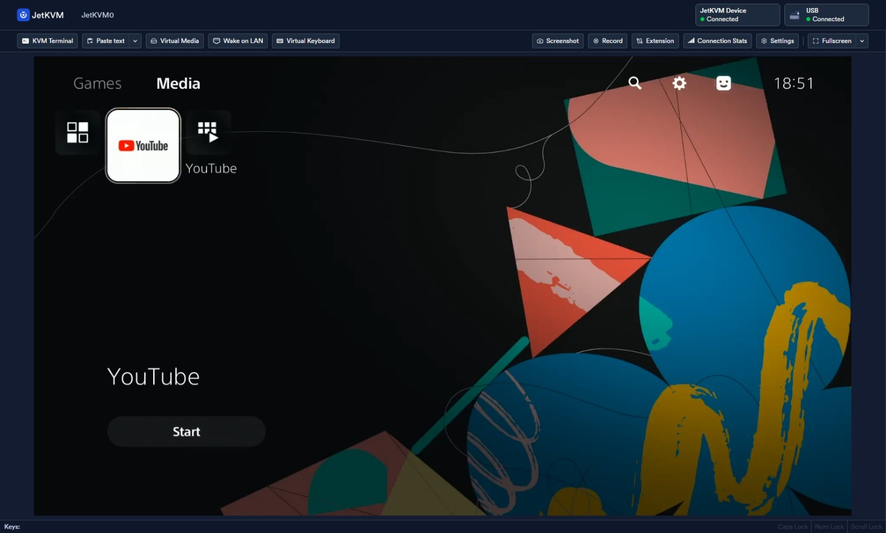
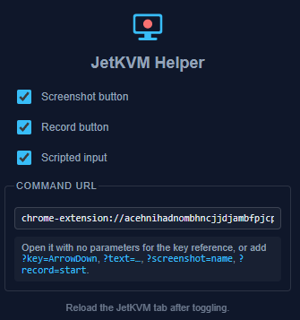

<center>

# JetKVM Helper


Screenshot and video capture buttons for the [JetKVM](https://jetkvm.com) UI, plus keystrokes you can trigger from a script.

[](https://github.com/andrewiankidd/BrowserExtensions/actions/workflows/publish-jetkvm-helper.yml)

### Links!

[](https://chromewebstore.google.com/detail/jetkvm-helper/oeekainmmcnajdjapcangfgacefdpeeh)

[](../install.md)

</center>

## Features

Two buttons are added to the JetKVM toolbar, next to its own:



### Screenshot

Saves the current frame as a PNG. It captures the video at full resolution, so you get the remote machine's actual screen rather than a crop of your browser window.

### Record

Click to start, click again to stop. The clip downloads as a `.webm`, recorded from the video stream itself — no browser chrome, no window borders.

### Scripted input

Off by default. Turn it on in the popup and you can send keystrokes by opening a URL, which means any script can drive the machine — handy for stepping through a BIOS or boot menu and grabbing a screenshot at each stage.



## Installing

Install from the store with the link above, or [load it unpacked](../install.md) if you'd rather run it from source. Then open your JetKVM at whatever address it lives on — `http://192.168.1.60/` works the same as `jetkvm.local`.

## Scripting

The popup shows your command URL. It looks like this:

```
chrome-extension://<id>/cmd/cmd.html
```

Open it with no parameters and it prints the full key reference. Add a parameter and it runs that command, then closes itself.

```bash
JETKVM="chrome-extension://<id>/cmd/cmd.html"

start chrome "$JETKVM?key=ArrowDown"            # press a key
start chrome "$JETKVM?key=F2"                   # enter BIOS setup
start chrome "$JETKVM?text=root%0A"             # type, %0A is Enter
start chrome "$JETKVM?screenshot=bios"          # saves bios.png
start chrome "$JETKVM?record=start"             # ...and ?record=stop
```

`msedge` works the same as `chrome`.

### Parameters

| | |
|---|---|
| `key` | One key. Add `modifiers=ControlLeft,AltLeft` to hold modifiers with it. |
| `text` | Type a string. Add `delay` in ms to type slower. |
| `steps` | A list of actions in one go — see below. |
| `screenshot` | Save the frame as `<name>.png`. |
| `record` | `start` or `stop`. Add `name` to choose the filename. |
| `target` | Which device, matched on its name or address. Only needed if you have more than one JetKVM tab open. |
| `keep` | Leave the tab open instead of closing it. |

### Key names

These are physical key names, not characters:

| | |
|---|---|
| Arrows | `ArrowUp` `ArrowDown` `ArrowLeft` `ArrowRight` |
| Editing | `Enter` `Escape` `Tab` `Space` `Backspace` `Delete` `Insert` |
| Paging | `Home` `End` `PageUp` `PageDown` |
| Function | `F1` … `F12` |
| Letters | `KeyA` … `KeyZ` |
| Digits | `Digit0` … `Digit9` |
| Modifiers | `ControlLeft` `ShiftLeft` `AltLeft` `MetaLeft`, and the `…Right` ones |

### Several actions at once

`steps` takes a list, so a whole sequence runs in one go. Each step is either `codes` (keys pressed together) or `text`, with an optional `delay` in ms afterwards.

```bash
start chrome "$JETKVM?steps=[{\"codes\":[\"ArrowDown\"],\"delay\":300},{\"codes\":[\"Enter\"],\"delay\":2000},{\"text\":\"admin\"}]"
```

Use this rather than several separate calls. It's one browser tab instead of many, and the order is guaranteed.

```bash
# record a boot, driving it as it goes
start chrome "$JETKVM?record=start&name=boot&target=rack-01"
start chrome "$JETKVM?steps=[{\"codes\":[\"F2\"],\"delay\":3000},{\"codes\":[\"ArrowDown\"]}]&target=rack-01"
start chrome "$JETKVM?screenshot=bios&target=rack-01"
start chrome "$JETKVM?record=stop&target=rack-01"
```

## Good to know

- Each command opens a browser tab. It shows nothing and closes itself, but it does take focus for a moment. Batching with `steps` is the way to keep that down.
- Commands don't report back. The exit code tells you nothing — if something fails, the tab stays open with the reason on screen instead of closing.
- Screenshots and recordings go to your downloads folder, so a script that needs the file should wait for it to appear.
- `text` assumes a US keyboard layout on the machine you're controlling. `key` and `steps` don't, so prefer them when it has to be exact.
- A key name JetKVM doesn't know does nothing, and still reports success. Its tab's console logs `Key down not mapped` if you need to check.
- The buttons only appear when your browser window is wide enough (about 1024px). Below that JetKVM hides that part of its own toolbar, so there's nowhere to put them.

## How it works

The buttons are clones of JetKVM's own Extension button with the icon and label swapped, so they match the theme exactly and keep matching it if JetKVM restyles.

Keystrokes are delivered as key events that JetKVM's own handlers pick up, so its keyboard mapping applies just as it would for someone typing.

There's no server and nothing to install alongside it. A browser extension can't listen on a port, so instead of running something for scripts to talk to, the script opens a URL and the extension does the work.
